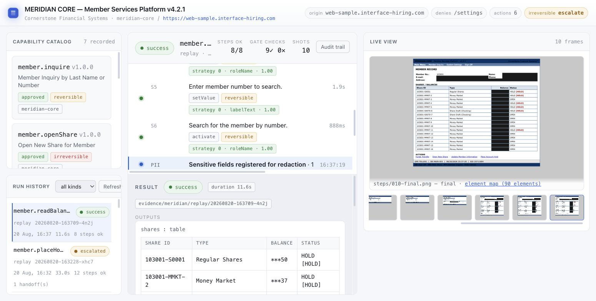
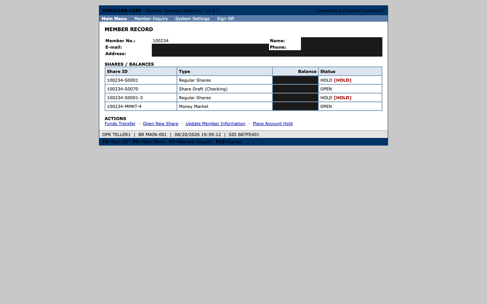
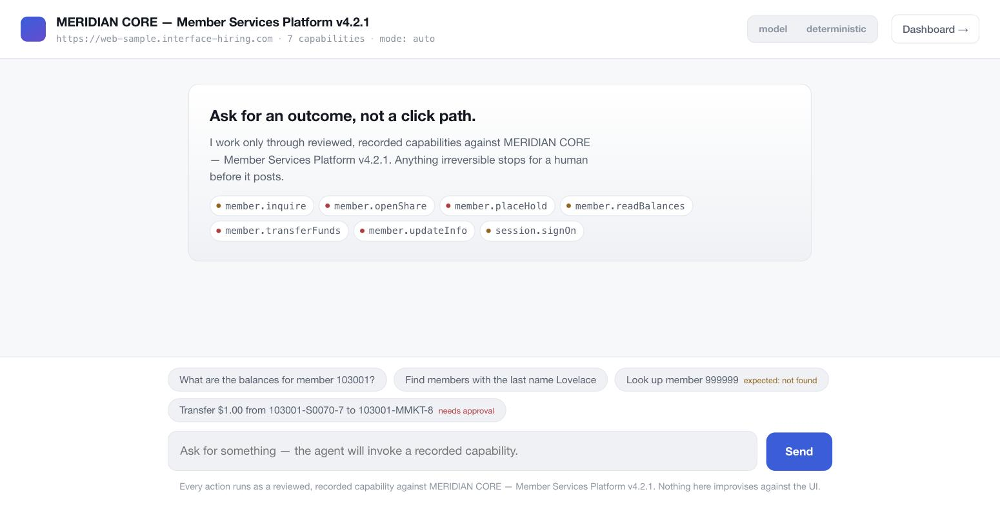
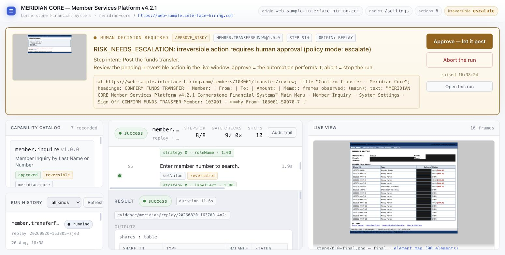

# Computer-Use Automation System

[](https://github.com/faizannraza/computer-use-automation/actions/workflows/ci.yml)

**An AI agent operates a legacy banking application that has no API — safely, deterministically, and
with an audit trail — by driving its UI the way a person would.**

The live target is **MERIDIAN CORE** ([web-sample.interface-hiring.com](https://web-sample.interface-hiring.com/)):
a period-accurate credit-union servicing console. Server-rendered HTML, table layout, no test IDs, a
hidden token its forms must carry, and functions a teller is not allowed to perform.

The core idea, in four steps:

1. An **LLM-driven agent** takes a goal in English and operates the live UI — observe, decide, act —
   with every action passing through one policy gate.
2. That successful run is compiled — **deterministically, no LLM** — into a typed, versioned,
   content-hashed **capability artifact**: a reviewable contract with typed inputs, typed outputs,
   and named business outcomes.
3. The artifact **replays with no model in the loop**. Everything it sees is classified three ways:
   an expected business outcome ("no such member"), a recoverable condition (a maintenance
   interstitial), or a hard failure (an ambiguous target).
4. When it cannot safely proceed — an irreversible action, a supervisor-only screen — it **stops and
   escalates to a human**, who decides on the same live session.

> **The model discovers once. Deterministic replay is how an agent invokes it in production.**

Seven capabilities are recorded against MERIDIAN CORE, exposed as a **callable API**, driven by a
**chatbot**, and watchable on a **dashboard** where a human approves anything irreversible.

**Start here:** [Run the console](#run-the-console) · [`DEMO.md`](DEMO.md) for a command-by-command
walkthrough · [`ADAPTATION.md`](ADAPTATION.md) for what adapting to this target took and what it
cost · [`evidence/meridian/`](evidence/meridian/README.md) for 19 committed runs against the live
target, indexed one row per runtime state.



*A capability replaying against the live target. The header states the policy the run is under; each
step shows which rung of the locator ladder resolved it; the live view shows the screenshot the run
captured, with regulated fields already masked; and the output is a typed table, not scraped text.*

```
   goal (natural language)                    typed params        "move $1 from A to B"
          |                                        |                      |
          v                                        v                      v
   discovery agent --> recorder --> compiler --> ARTIFACT --> replay engine <-- API <-- chatbot
     (LLM in loop)                  (NO LLM)    (typed,        (NO LLM, ever)   |     (LLM plans,
          |                                      versioned,          |          |      never acts)
          |                                      hashed,             |          v
          |                                      approved)           |      dashboard
          |                                                          |      (watch / APPROVE / audit)
          +----------+  every action, every path  +------------------+
                     v                            v
        +-----------------------------------------------------+
        |  ActionGate:  control token | origin+path allowlist  |
        |               action kinds  | risk class             |
        +-----------------------------+-----------------------+
                                      v
                    Surface seam:  observe / resolve / act
                    (Playwright web today; desktop by design)
                                      v
                      +---------------------------------+
                      |  app profile (JSON, per target) |
                      +---------------------------------+
                         MERIDIAN CORE   |   MockCore
```

**One artifact, two engines, one gate.** Discovery and replay never import each other — the artifact
is their only interface — and every action from every path is authorised in the same place.

A second target, **MockCore Teller**, ships as a local mock so the whole system is demonstrable with
no network and no API key. Which application is being driven is a JSON file in
[`profiles/`](profiles/), not code.

## Setup

Requires Node.js >= 20.

```bash
npm install
npx playwright install chromium
cp .env.example .env        # works as-is; the MERIDIAN operators in it are the brief's public demo accounts
```

**Keys.** `ANTHROPIC_API_KEY` is needed by exactly two things: `cu discover` (recording a *new*
capability) and the chatbot's LLM planner. **Everything else — deterministic replay, the capability
API, the dashboard, human-in-the-loop, and the entire test suite — runs with no key**, because the
production path never calls a model. The chatbot also ships a deterministic `scripted` planner
behind the same interface, so even that surface is demonstrable without one.

```bash
npm run typecheck && npm run lint && npm test    # 379 tests, ~26 s, fully offline
```

---

## Run the console

One process serves the API, the dashboard and the chatbot.

```bash
npm run demo
```

Then open **<http://127.0.0.1:4180/>** (dashboard) and **<http://127.0.0.1:4180/chat/>** (chatbot).

That is the whole setup. `npm run demo` points the server at MERIDIAN CORE and turns on three
**presentation** settings, which the startup banner names so they are never a surprise:

| | |
|---|---|
| `CU_ALLOW_INJECT=1` | puts the app's own fault kinds on the invoke form, so you can force a 503 or a 440 from the UI. Off by default, because injection rewrites the request *beneath* the ActionGate — a recorded capability can never reach it; only the operator starting the process can. |
| `CU_DEMO_HEADED=1` | opens a real browser window for every run, so there is something to watch. |
| `CU_DEMO_SLOW_MO=700` | paces that window — including per-keystroke typing — so a person can follow it. |

The last two apply to **every** run the server drives, including the ones the chatbot starts: a
planner chooses a capability and its parameters and nothing else, so pacing is the operator's
decision, made once at startup. Both are off by default — a production replay runs headless at full
speed — and both can be overridden per run from the dashboard's invoke form.

Two other entry points, same server:

```bash
npm run api:meridian   # MERIDIAN CORE, no presentation settings — how it would actually run
npm run api:mock       # the local mock; needs `npm run mock` in another terminal, and no network
```

## What to look at, in order

Everything below is a **read** until step 4. Nothing changes the target until you choose to.

### 1. The catalog, and the fence it runs under

The dashboard's left column lists seven capabilities — one per function in the brief — each badged
`approved`, its risk class, and (on `member.placeHold`) `role: supervisor`. The header states the
policy the run is under before anything happens: allowed origin, **denied paths `/settings`**, six
allowed verbs, and `irreversible → escalate`.

`/settings` is the target's own global fault-injection screen. The automation is denied it
deliberately: a system that can switch off its target's failure injection is not demonstrating error
handling.

### 2. Watch a capability drive the live app

Click **`member.readBalances`** → `memberId` `103001` → tick **Watch headed browser** → **Invoke**.

- Each step shows its intent, duration, action kind, risk chip, and the **locator strategy rank**
  (`strategy 0 · roleName · 1.00`). Strategy 0 is the most robust rung on the ladder; a step that
  starts resolving at rung 2 is UI drift, captured on every replay for free.
- The last step is a single `readTable` returning every share, balance and status as typed rows.
- The **live view** shows the screenshot the run captured — with the member's name, e-mail, phone,
  address and every balance **blacked out**, while share ids, types and statuses stay readable.



*A committed capture from an earlier run (member 100234, not the 103001 above) — the masking is the
point, and it looks the same for any member.*

That masking is not a filter over the image. The app profile declares which fields are regulated —
by label, by label *pattern*, and by column header — and the mask is burned into the capture inside
the same observation the classifier ran on. The caller still receives the real values: an invoke
response is the **caller** channel, `evidence/` is the **auditor** channel, and the same run reads
differently through the two on purpose.

### 3. The three ways a run can end badly

Invoke these from the same form. Because `npm run demo` enabled it, there is a **fault** dropdown.

| Capability | Params | Fault | Result |
|---|---|---|---|
| `member.readBalances` | `memberId` `999999` | — | `business_outcome` · `MEMBER_NOT_FOUND` |
| `member.readBalances` | `memberId` `103001` | `maintenance` | `success` · `recovered ×1` |
| `member.placeHold` | any member / share | — | **refused before a browser opens** · `requiresRole 'supervisor'` |

Three different things, reported three different ways. "No such member" is a **result** the caller
switches on — the CLI even exits zero. The maintenance interstitial is **recoverable**: it restarted
and finished. And `member.placeHold` never gets as far as the app: the dashboard's role selector
defaults to `teller`, the capability was recorded as `supervisor`, and the API compares the two
before it launches anything.

For the **escalation** itself — the automation reaching MERIDIAN's supervisor-override screen and
handing the decision to a person — open the committed run `20260820-141322-ad9v` in Run history. That
one came through the CLI, which does not apply the pre-flight role check, so it reaches the screen
and stops there.

Run history shows all of them side by side with different pills. Conflating a business outcome, a
recoverable condition and a hard failure is the failure this problem invites, so the distinction is
structural: separate schema sections, separate result types, one explicit priority order.

### 4. The human gate — nothing irreversible happens without it



In the **chatbot**, click *Transfer $1.00 from 103001-S0070-7 to 103001-MMKT-8*.

The planner picks a capability by name from the catalog. It cannot invent a capability and it cannot
invent a parameter. Switch to the dashboard: an amber bar appears naming the capability, the version,
the step, the policy reason, and a summary of the screen in which the member's name is **already
masked**.



Click **Approve — let it post**. A confirmation number comes back.

Three things make that gate real rather than decorative:

- Approving requires that intervention's **one-time nonce**, which is deliberately absent from the
  listing endpoint — a guard published by the endpoint it guards is not a guard.
- Before acting, the engine re-observes, re-locates the control **by identity**, refuses if the match
  is ambiguous, refuses if the page navigated, and diffs the form's values against what the human
  reviewed. The approval binds to the transaction, not just to the button.
- `HttpOperator` implements the same `Operator` interface the terminal console does, and the gate
  checks a control token on **every** action — so the automation is genuinely locked out while a
  human holds the session.

**The API cannot post money unattended.** Structurally, not by policy document.

### 5. The artifacts were compiled, not written

```bash
npm run cu -- recompile capabilities-meridian/member.readBalances@1.0.0.json \
  --trace evidence/meridian/discovery/20260820-124803-gz6r \
  --app profiles/meridian-core.profile.json
# → "recompiles identically (modulo the approval block and its hash) — the shipped
#    artifact is exactly what this compiler produces from this trace."
```

The compiler is deterministic code. Point it at the committed trace and the executable spine — steps,
locators, conditions, risk classes, success criteria — re-derives byte for byte, with no network and
no key. Five of the seven reproduce exactly; the two that do not are explained in
[`evidence/meridian/README.md`](evidence/meridian/README.md).

Then, in the dashboard: **Audit trail → Element maps**. Screenshots show what a *person* would have
seen; the element map shows what the **locator ladder** saw. That is the only artifact that explains
why a target resolved, or why it refused as ambiguous.

### 6. The evidence

[`evidence/meridian/README.md`](evidence/meridian/README.md) indexes **19 committed runs** — one per
row of the brief's runtime-state taxonomy, all against the live target, no model in any of them:

**9 success** (every one of the seven capabilities completes at least once) · **6 business outcomes**
· **3 escalations** · **1 hard failure**. All six of the target's `inject` kinds are covered.

---

## Command line

The console is the nice way in; everything is also a command.

```bash
# deterministic replay — no model, no key
npm run cu -- replay --capability capabilities-meridian/member.readBalances@1.0.0.json \
  --app profiles/meridian-core.profile.json --param memberId=103001
```

`--app` points the run at the target's profile: base URL, policy, operator roles, app-level
recoveries and the field classification. Useful flags:

| | |
|---|---|
| `--role supervisor` | sign on as the other operator |
| `--headed --slow-mo 700` | watch it drive, paced for a person |
| `--inject maintenance@s4` | force one of the app's documented faults on a chosen step |
| `--times 10` | replay N times and aggregate a flakiness report |
| `--hitl` | approve irreversible steps yourself, on the live session |

```bash
npm run cu -- validate capabilities-meridian/*.json   # schema + integrity for all seven
npm run cu -- catalog --dir capabilities-meridian     # the tool definitions an agent would consume
```

> **Note.** CLI output is the **caller** channel and is deliberately *not* redacted — that is where
> real balances are supposed to appear. If you are showing a screen to other people, use the
> dashboard, which reads from the redacted evidence channel.

### The API directly

```bash
curl -s localhost:4180/api/capabilities | jq '.[].name'

curl -s -X POST localhost:4180/api/capabilities/member.readBalances/invoke \
  -H 'content-type: application/json' -d '{"params":{"memberId":"103001"}}'
```

An irreversible capability returns `202` with a run id and parks:

```bash
curl -s -X POST localhost:4180/api/capabilities/member.transferFunds/invoke \
  -H 'content-type: application/json' \
  -d '{"params":{"memberId":"103001","fromShare":"103001-S0070-7","toShare":"103001-MMKT-8","amount":"1.00","memo":"Q3 rebalance"}}'

curl -s localhost:4180/api/interventions               # the pending decision + its screenshot
curl -s localhost:4180/api/interventions/<key>/nonce   # fetched at approve time, never listed
curl -s -X POST localhost:4180/api/interventions/<key>/resolve \
  -H 'content-type: application/json' -d '{"action":"approve","nonce":"<nonce>"}'
```

**Be clear about the security posture:** this API has **no authentication**. Its boundary is the
transport — a loopback bind *plus* a `Host` check, because a loopback bind alone does not survive DNS
rebinding. The nonce means a caller must name one specific pending decision rather than harvest
approvals from a listing. A real deployment needs real authentication here.

### Recording a new capability

The only step that uses a model.

```bash
npm run cu -- discover --app profiles/meridian-core.profile.json \
  --goal "Sign on, look up member 103001, and read every share with its balance and status." \
  --param memberId=103001:internal \
  --env-param operatorId=MERIDIAN_OPERATOR_ID:internal \
  --env-param operatorPassword=MERIDIAN_OPERATOR_PASSWORD:secret \
  --output shares \
  --save-dir /tmp/cu-discovered --evidence-dir evidence/meridian
# → a DRAFT artifact. Review it, then: npm run cu -- approve <file> --by "your name"
```

Recording a flow that posts money needs a human to authorise each irreversible click: add `--hitl` to
approve them interactively, or `--authorise-recording-as "<name>"` to pre-authorise a scripted
session — which stamps the authoriser's name onto every `intervention_resolved` event in the run log.

All seven capabilities cost about **$6 total** to record — roughly $0.90 each. Discovery runs once;
the ten-thousandth replay costs one browser session.

---

## Offline: the same system with no network

**MockCore Teller** is a local mock built legacy-hostile on purpose — framesets, table layout, no
test IDs — with deterministic fault injection. Every scenario in
[`evidence/replay/`](evidence/README.md) reproduces on your machine with no network and no key.

```bash
npm run mock                         # terminal 1

npm run cu -- replay --capability capabilities/member.readSavingsBalance@1.0.0.json --param memberId=12345
# → success, savingsBalance = "$4,821.97"

npm run cu -- replay --capability capabilities/member.readSavingsBalance@1.0.0.json --param memberId=99999
# → business_outcome MEMBER_NOT_FOUND (a result, not a crash; exit code 0)

npm run cu -- replay --capability capabilities/member.readSavingsBalance@1.0.0.json \
  --tenant tenants/demo-fcu.overlay.json --param memberId=12345 --inject-fault session_timeout:once
# → success, recoveriesUsed: [SESSION_TIMEOUT]

npm run cu -- replay --capability capabilities/member.readSavingsBalance@1.0.0.json \
  --param memberId=12345 --inject-fault duplicate_button:on
# → failed TARGET_AMBIGUOUS at s6 — it refuses to guess, and names both candidates

curl -s -X POST localhost:4173/__reset    # ':on' faults stay armed — clear before the next run
```

**Cross-tenant reuse** — the same artifact against a re-skinned tenant ("Log On" instead of "Sign
In", "Find Member" instead of "Search"):

```bash
npm run mock:summit    # terminal 1, alongside the default mock — serves port 4174

npm run cu -- replay --capability capabilities/member.readSavingsBalance@1.0.0.json \
  --param memberId=12345 --base-url http://localhost:4174 --policy policies/summit-fcu.policy.json
# → failed TARGET_NOT_FOUND at s3 — an honest miss on the renamed control, never a guessed click

npm run cu -- replay --capability capabilities/member.readSavingsBalance@1.0.0.json \
  --tenant tenants/summit-fcu.overlay.json --param memberId=12345 --policy policies/summit-fcu.policy.json
# → success — two additive locator patches, the artifact was not re-recorded
```

For the console, dashboard and chatbot against the mock: `npm run api:mock`.

---

## If a run suddenly fails

**The target is shared, and other people are using it.** Two causes, in order of likelihood.

**1. Its global fault switch is armed.** MERIDIAN's System Settings screen sets a *server-side,
app-wide* error mode that anyone can turn on and that stays on. The symptom is unmistakable: *every*
capability fails the same way at once, with a repeating recovery code on a run you did not inject.
Clear it by hand at <https://web-sample.interface-hiring.com/settings> (error mode → none, rate → 0).
The automation cannot do it for you — `/settings` is denied on purpose.

**2. The share you named has changed.** Shares get opened and put on `HOLD` between runs. Read the
member first and pick shares that are currently `OPEN`:

```bash
npm run cu -- replay --capability capabilities-meridian/member.readBalances@1.0.0.json \
  --app profiles/meridian-core.profile.json --param memberId=103001
```

## Repo map

```
capabilities-meridian/  the seven MERIDIAN CORE capabilities — all LLM-discovered, then approved
profiles/           which application this is: meridian-core, mockcore-teller (JSON, not code)
evidence/meridian/  19 committed live runs + 7 discovery runs (see its README for the index)

apps/mock-cu/       the offline target: legacy-hostile mock credit union + fault injection + skins
src/core/           surface-agnostic vocabulary (Observation, SemanticAction) + templates
src/surface/        the Surface seam; Playwright web implementation (element map, locator ladder)
src/policy/         policy config, redaction, and the ActionGate; every action funnels through it
src/schema/         capability artifact, conditions, tenant overlays, result contract (Zod)
src/discovery/      LLM agent loop, tool executor (the model-free harness half), recorder, compiler
src/replay/         condition evaluation, the deterministic replay engine, stability aggregation
src/hitl/           session controller (control token), human-action capture, terminal operator
src/catalog/        agent-facing capability catalog
src/profile/        app profiles: what is true of a TARGET APP rather than of one recorded flow
src/api/            the capability API (invoke by name), run registry, SSE, HTTP operator
src/chat/           the chatbot's planner — LLM tool-calling over the catalog, plus a scripted mode
web/                dashboard/ (watch, approve, audit) and chat/ — plain HTML/JS, no build step
capabilities/       MockCore artifacts (readSavingsBalance LLM-discovered; openSubAccount hand-authored)
tenants/            tenant overlays (demo-fcu recoveries; summit-fcu re-skin re-ranking)
policies/           allowlist/risk policies: default, summit-fcu, meridian
evidence/replay/    MockCore runs, reproducible offline (see evidence/README.md)
tests/              379 tests (~26 s) incl. live end-to-end scenarios against the mock app;
                    fixtures/ holds a hand-authored gold artifact used only as
                    test fixture and compiler diff baseline
DEMO.md             a command-by-command walkthrough of the live system
ADAPTATION.md       what pointing the core at MERIDIAN CORE took, and what it exposed
REPORT.md           the original core's design write-up
```

Two write-ups, deliberately separate. [`ADAPTATION.md`](ADAPTATION.md) covers this project: what
adapting to MERIDIAN CORE actually took, the API contract, how the runtime states are handled, and
what was cut. [`REPORT.md`](REPORT.md) is the original core's design write-up — architecture,
artifact schema rationale, determinism, the multi-tenant story, escalation, and safety.
